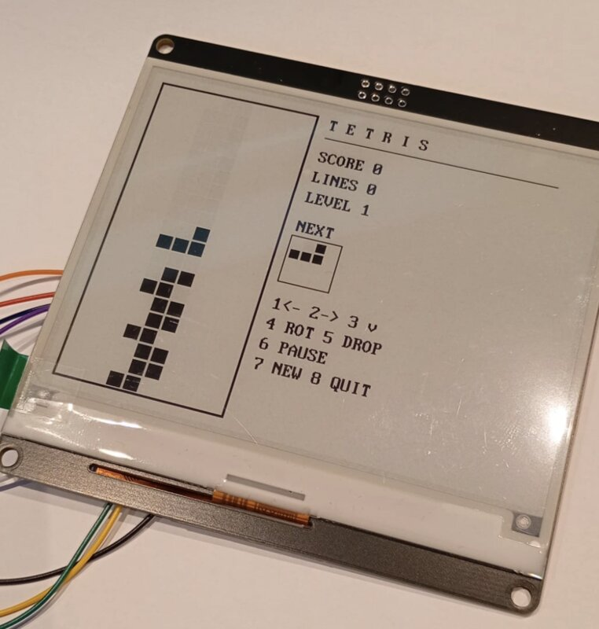

# weact-4.2-pico

A clean SSD1683 driver for the **WeAct 4.2" e-paper** (Seekink E042A87, 400 × 300, 1-bit B/W) on the **Raspberry Pi Pico** / RP2040.

Hardware SPI, dirty-rectangle differential partial refresh, deep sleep, full font + 1bpp graphics — under 1000 lines of code total.



## Layout

```
src/                 ← the drop-in library
  epd.h epd.c         driver core (init, refresh, sleep)
  epd_config.h        SPI peripheral + pin assignments
  gfx.h gfx.c         1bpp graphics on the framebuffer
  font8x16.c          96-glyph ASCII font

examples/
  demo/               splash + partial ticker + deep-sleep cycle
  tetris/             playable tetris driven by 8 GPIO keys
  rot/                cycles all four rotations
  fonts/              all seven bundled fonts side-by-side

tools/
  convert_font.py     bake any TTF/OTF into a packed-bitmap C source
```

To use the driver in your own project, copy `src/` and edit `epd_config.h` for your pin map.

## Wiring

| Panel | RP2040    | Note               |
|-------|-----------|--------------------|
| VCC   | 3V3       |                    |
| GND   | GND       |                    |
| SCK   | GP26      | spi1 SCK           |
| MOSI  | GP27      | spi1 TX            |
| CS    | GP21      |                    |
| DC    | GP22      |                    |
| RST   | GP28      |                    |
| BUSY  | GP20      | input, panel drives HIGH while busy |

Edit `src/epd_config.h` to change.

## Build

```sh
export PICO_SDK_PATH=~/path/to/pico-sdk
mkdir build && cd build
cmake .. && make -j
```

Produces `examples/demo/demo.uf2` and `examples/tetris/tetris.uf2`. Hold BOOTSEL while plugging the Pico in, then drag a `.uf2` to `RPI-RP2`.

## API

The entire public surface is in `epd.h` and `gfx.h`.

### Display (`epd.h`)

```c
#define EPD_W      400
#define EPD_H      300
#define EPD_PITCH  (EPD_W / 8)        // 50 bytes per row
#define EPD_BYTES  (EPD_PITCH * EPD_H) // 15000 bytes per frame
```

```c
void     epd_init(void);              // SPI + GPIO + panel init
void     epd_sleep(void);             // deep sleep (~3 µA); next refresh auto-wakes
uint8_t *epd_fb(void);                // direct framebuffer access (15000 bytes)
void     epd_clear(bool black);       // memset the framebuffer
void     epd_mark_dirty(int x0, int y0, int x1, int y1); // only needed after raw epd_fb() writes

void     epd_refresh_full(void);      // ~2 s, clears ghosting (blocking)
void     epd_refresh_partial(void);   // ~300 ms, differential against last frame (blocking)

void     epd_refresh_full_async(void);    // kick off, return when transfer + activate done (~13 ms)
void     epd_refresh_partial_async(void); // same, only sends the dirty rect; no-op if nothing changed
bool     epd_busy(void);              // panel still rendering?
void     epd_wait(void);              // block until panel idle

void     epd_set_rotation(int rot);   // 0/1/2/3 = 0° / 90° CW / 180° / 270° CW
int      epd_rotation(void);
int      epd_width(void);             // logical width  (400 or 300 depending on rotation)
int      epd_height(void);            // logical height (300 or 400)
```

The framebuffer is one contiguous 15000-byte block, 1 bit per pixel, MSB = leftmost pixel, **1 = white, 0 = black** (matches the SSD1683 RAM polarity).

Every `gfx_*` call expands a dirty rectangle around the physical pixels it touched; a partial refresh windows the controller RAM to that rect (x rounded out to 8-px byte boundaries), transfers only it, and skips entirely when nothing changed. If you write to `epd_fb()` directly, tell the driver with `epd_mark_dirty(x0, y0, x1, y1)` (physical pixels, inclusive) or the partial refresh won't see your changes.

A typical update is just three calls:

```c
epd_clear(false);                 // white background
gfx_text(20, 20, "Hello!", false);
epd_refresh_full();
```

After `epd_sleep()`, any subsequent `epd_refresh_*` will hardware-reset and re-init the panel automatically — call it whenever you're done updating and want to drop to micro-amp idle current.

### Graphics (`gfx.h`)

All shapes write into the framebuffer; nothing reaches the panel until you call a refresh. `black` selects ink (true = black, false = white). For `gfx_char` / `gfx_text`, `invert = false` means black text on white background.

```c
void gfx_pixel      (int x, int y, bool black);
void gfx_hline      (int x, int y, int w, bool black);
void gfx_vline      (int x, int y, int h, bool black);
void gfx_line       (int x0, int y0, int x1, int y1, bool black);
void gfx_rect       (int x, int y, int w, int h, bool black);
void gfx_fill_rect  (int x, int y, int w, int h, bool black);
void gfx_circle     (int cx, int cy, int r, bool black);
void gfx_fill_circle(int cx, int cy, int r, bool black);

void gfx_char       (int x, int y, char c, bool invert);                          // default 8x16
void gfx_text       (int x, int y, const char *s, bool invert);                   // default 8x16
void gfx_char_f     (int x, int y, char c, bool invert, const gfx_font_t *font);
void gfx_text_f     (int x, int y, const char *s, bool invert, const gfx_font_t *font);
```

`gfx_fill_rect` (and its `hline` / `vline` shims) hit byte-aligned `memset` on the middle bytes after transforming to physical coordinates — fast at every rotation. Everything else is per-pixel through `gfx_pixel`. All coordinates are clipped to the panel.

### Fonts

Seven bundled fonts, all monospace, packed as 1-bit bitmaps:

```c
extern const gfx_font_t gfx_font_8x16;          // built-in default, 1.5 KB
extern const gfx_font_t gfx_font_dep_10x21;     // Departure Mono @16, ~2 KB
extern const gfx_font_t gfx_font_dep_13x26;     // Departure Mono @20, ~2.5 KB
extern const gfx_font_t gfx_font_dep_15x31;     // Departure Mono @24, ~3 KB
extern const gfx_font_t gfx_font_3270_10x21;    // 3270 Mono @18, ~2.5 KB
extern const gfx_font_t gfx_font_3270_12x23;    // 3270 Mono @20 bold, ~2.8 KB
extern const gfx_font_t gfx_font_3270_14x27;    // 3270 Mono @24 bold, ~3.8 KB
```

To add your own, point `tools/convert_font.py` at a TTF or OTF:

```sh
python3 tools/convert_font.py myfont.otf 18 gfx_font_my_18 > src/font_my_18.c
```

For thin-stroked fonts that wash out on e-paper, add `--bold` for a 1-px horizontal dilation. The cell width grows by 1 px and every stroke roughly doubles in weight; the bundled 3270 fonts use this.

```sh
python3 tools/convert_font.py --bold myfont.ttf 14 gfx_font_my_b > src/font_my_b.c
```

Add the generated file to `add_library(weact_epd ...)` in `CMakeLists.txt`, declare `extern const gfx_font_t gfx_font_my_18;` (or in your code directly), and pass it to `gfx_text_f`.

## Refresh strategy

- **Full** (`0x22 = 0xF7`): loads the OTP mode-1 LUT, drives every pixel through the full waveform. The driver writes the frame to both BW RAM (`0x24`) and RED RAM (`0x26`) — the "base map" — so the controller knows what's on the glass. ~2 s, no ghosting.
- **Partial** (`0x22 = 0xFF`): loads the OTP mode-2 LUT and runs the differential update — new frame in BW RAM against the displayed frame in RED RAM. Unchanged pixels hit the LUT's "stay" entries and don't move at all; only the actually-different pixels get driven. ~300 ms, no fading on unchanged regions.

The previously-displayed frame lives **in the controller**, not on the MCU: after every mode-2 update the SSD1683 copies BW RAM into RED RAM by itself (RAM ping-pong), so a partial refresh only has to send what changed — the gfx layer tracks a dirty rectangle and the driver sets the RAM window to it and streams just those bytes (a worst-case full frame is 15 KB, ~6 ms at 20 MHz). Window granularity is 8 px (one byte) in x, 1 px in y. The waveform itself still scans the whole panel — the window shrinks the transfer, not the ~300 ms refresh — and the rest of the time is waited on the `BUSY` pin.

For long-running partial-update sessions (e.g. the Tetris example), schedule an occasional `epd_refresh_full()` — every 30–50 partials is a reasonable rhythm — to clear accumulated waveform drift.

### Async refresh

The panel takes ~300 ms to actually draw a partial frame and ~2 s for a full one — most of which is the controller running the waveform with the SPI bus idle. The async API splits this:

1. `epd_refresh_*_async()` waits for any prior refresh to finish, streams the dirty rect, fires `MASTER_ACTIVATE`, and returns (a few ms — almost all of it the SPI transfer).
2. The panel keeps drawing in the background while your main loop runs.
3. Call `epd_busy()` before the next refresh; only kick off a new one when it returns false.

```c
bool dirty = true;
while (1) {
    poll_input();          // runs every loop, regardless of panel state
    update_game_state();
    if (dirty && !epd_busy()) {
        render_to_fb();
        epd_refresh_partial_async();
        dirty = false;
    }
    sleep_ms(2);
}
```

Multiple state changes during a refresh coalesce — the next render captures the latest state, not every intermediate one. Input latency drops from one full refresh (~300 ms) to one dirty-rect transfer (a few ms).

## Credits

Driver written by **Claude Opus 4.7**, tested on real hardware by **[jackdoe](https://github.com/jackdoe)**.

## License

Public domain / do whatever you want.
